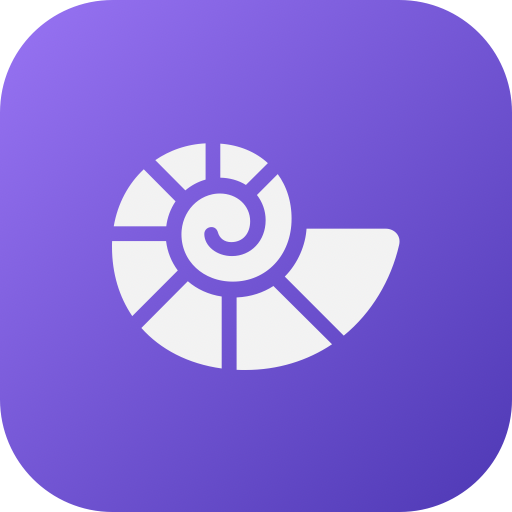

<p align="center">
  
</p>

<h3 align="center">Clam</h3>
<p align="center">Claude session manager for your macOS menu bar</p>

<p align="center">
  
  
  
  
</p>

---

## Overview

Clam lives in your menu bar and gives you quick access to your Claude Code sessions and API usage at a glance.

- See all active Claude Code sessions with their terminal and project
- Monitor rate limits (5-hour, weekly) and token usage (daily, monthly)
- Search and resume past sessions from any project
- Click to focus or resume sessions in your preferred terminal
- Zero dependencies — pure Swift and SwiftUI

## Install

### Homebrew

```sh
brew install naufalafif/tap/clam
```

### Manual

Download the latest `.zip` from [Releases](https://github.com/naufalafif/clam/releases), unzip, and drag `Clam.app` to `/Applications`.

### Build from source

```sh
git clone https://github.com/naufalafif/clam.git
cd clam
make install
```

## Usage

Clam runs as a menu bar app — no dock icon, no windows to manage.

**Menu bar** shows your current 5-hour rate limit percentage and reset time.

**Click the icon** to see:
- Active sessions — click any session to jump to its terminal
- Rate limits with color-coded progress bars
- Token usage and cost for today and this month

**Search sessions** (`⌘K` from the popover) to find and resume past conversations.

**Settings** let you pick your preferred terminal (Ghostty, iTerm2, Terminal, Alacritty, WezTerm) and enable launch at login.

## Documentation

| | |
|---|---|
| [How it works](docs/explanation.md) | Architecture, data sources, and design decisions |
| [Configuration](docs/reference.md) | Settings, data paths, and supported terminals |

## Contributing

```sh
make check    # build + test + lint + format check
make test     # run tests only
make run      # build and launch for development
```

See [CONTRIBUTING.md](CONTRIBUTING.md) for details.

## License

MIT
